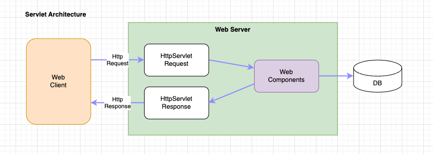
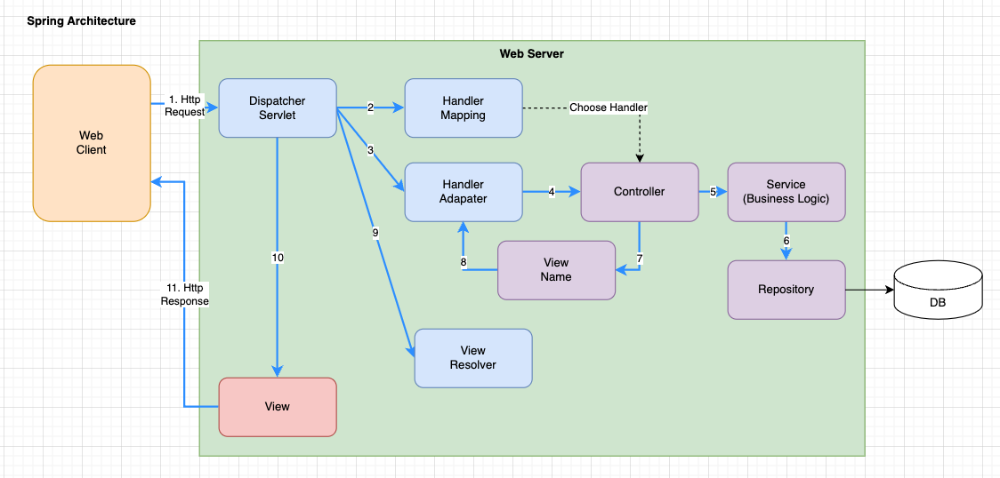
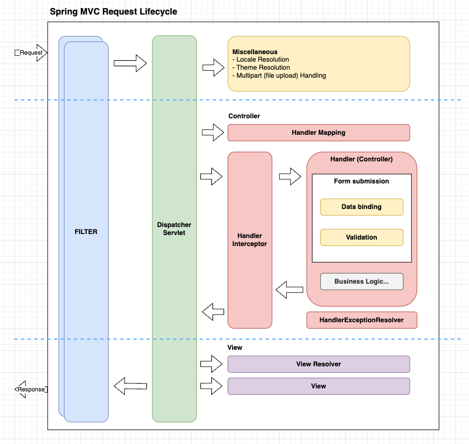

# Spring Architecture 이해하기

## Servlet Architecture

- serverlet architecture 는 위 그림과 같이 매우 단순하다.
- 1. 웹 클라이언트 (브라우저) 에서 Http Request 요청을 서블릿으로 보낸다.
- 2. Servlet은 HttpServletRequest 를 받아 들여서 헤더와 페이로드를 분석 및 조작한다.
- 3. request 정보를 Web Component 에 전달하고, Web Component 는 필요한 비즈니스 로직을 수행한다.
- 4. 처리 결과를 수집하고, HttpServletResponse 에 담아서 Web Client 로 전달한다.

## Spring Architecture

- spring architecture 는 Servlet 을 내부적으로 사용하고 좀더 복잡한 형태로 Wrapping 되어 있다.
- 1. 웹 클라이언트 (브라우저) 에서 Http Request 요청을 Spring Web Server로 요청을 보낸다.
- 2. 들어온 요청을 기준으로 Dispatcher Servlet 이 요청을 어디로 분배 해야할지 결정한다.
- 3. Dispatcher Servlet 은 Handler Mapping에게 요청을 어디로 보내야할지 문의한다.
- 4. 처리해야할 핸들러를 찾고 나면 Handler Adapter 로 요청을 전달한다.
- 5. Handler Adapter은 Controller 에 연결되고, 요청을 컨트롤러가 받는다. 컨트롤러는 개발자가 직접 개발하는 영역이다.
- 6. Controller 은 Service 에 비즈니스 처리 요청을 보낸다.
- 7. Service는 비즈니스 로직을 처리하면서 DB 처리가 필요한 경우 Repository 요청을 보낸다.
- 8. Repository는 필요한 DB(RDBMS, NoSQL, File 등) 처리를 수행하고 결과를 반환한다.
- 9. 처리된 결과를 컨트롤러까지 전달된다.
    - 일반 Controller인경우 뷰 이름을 핸들러에 전송하고 적절한 뷰를 기다린다.
    - RestController인 경우 컨텐츠 내용을 Handler에 전달한다.
- 10. Dispatcher은 핸들러 어댑터의 결과에 따라 View Resolver에게 클라이언트로 보낼 데이터를 만들어 낸다.
- 11. 최종적으로 뷰 리졸버를 통해서 View가 화면에 노출될 컨텐츠를 담고 있고, 이를 HttpResponse로 반환하게 된다.

## Spring Lifecycle

- 스프링 라이프사이클을 확인하자.
- 즉 요청이 들어와서 어떻게 흘러가는지를 한눈에 파악할 수 있다.
- 관련 내용은 위 아키텍처에 기술한것과 동일하다. 
